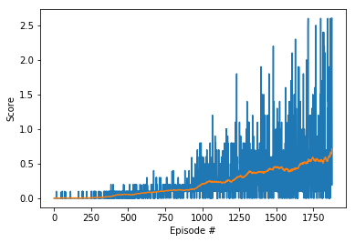
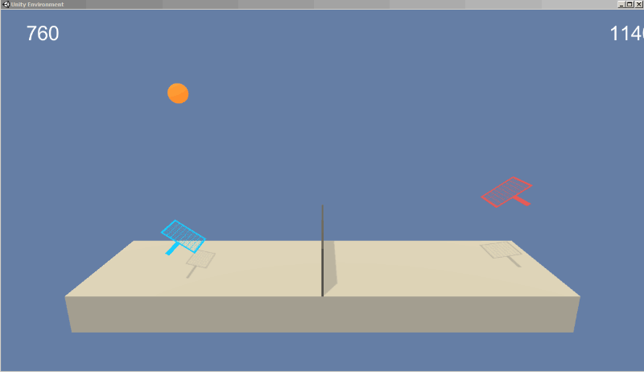

# Train a pair of agents to play tennis with MADDPG algorithm

## Environment
Unity Machine Learning Agents ([ML-Agents](https://github.com/Unity-Technologies/ml-agents)) is an open-source Unity plugin that enables games and simulations to serve as environments for training intelligent agents. 

This repo presents code and step by step guide on how to train two intelligent agents to solve the [Tennis environment](https://github.com/Unity-Technologies/ml-agents/blob/master/docs/Learning-Environment-Examples.md#tennis).

In slightly modified Tennis environment, two agents control rackets to bounce a ball over a net. If an agent hits the ball over the net, it receives a reward of +0.1. If an agent lets a ball hit the ground or hits the ball out of bounds, it receives a reward of -0.01. Thus, the goal of each agent is to keep the ball in play.

The observation space consists of 8 variables corresponding to the position and velocity of the ball and racket. Each agent receives its own, local observation. Two continuous actions are available, corresponding to movement toward (or away from) the net, and jumping.

## Goal
The goal is to train agents to keep the ball boucing back and forth between them without falling to the ground or out of bounds for as long as possible in order to maximize the scores.  
This task is episodic, and in order to solve the environment, the agents must get an average score of +0.5 (over 100 consecutive episodes, after taking the maximum over both agents). Specifically,  

* After each episode, we add up the rewards that each agent received (without discounting), to get a score for each agent. This yields 2 (potentially different) scores. We then take the maximum of these 2 scores.     
* This yields a single score for each episode.

As an example, consider the plot below, where we have plotted the score obtained with each episode (blue curve) as well as the average scores (orange curve, moving average over a window of 100 consecutive episodes).  

  

The environment is considered solved, when the average (over 100 episodes) of those scores is at least +0.5.

## Result
A movie clip demonstrating successfully trained agents (achieving an average score of +0.7) is shown below. The trained players can keep the tennis ball boucing back and forth without falling to the ground or out of bounds for many rounds.  

  

## Dependencies
* Numpy
* Matplotlib
* PyTorch (0.4.0 or above)
* ML-Agents toolkit (`pip install unityagents`) 

## Usage
* The Windows (64-bit) version of the environment is provided in this repo in the folder "Tennis_Windows_x86_64".
* Mac OSX version can be downloaded [here](https://s3-us-west-1.amazonaws.com/udacity-drlnd/P3/Tennis/Tennis.app.zip)
* Linux version can be downloaded [here](https://s3-us-west-1.amazonaws.com/udacity-drlnd/P3/Tennis/Tennis_Linux.zip)

Follow the step by step instructions in **Report.ipynb** to start running the environment and training the agents.
